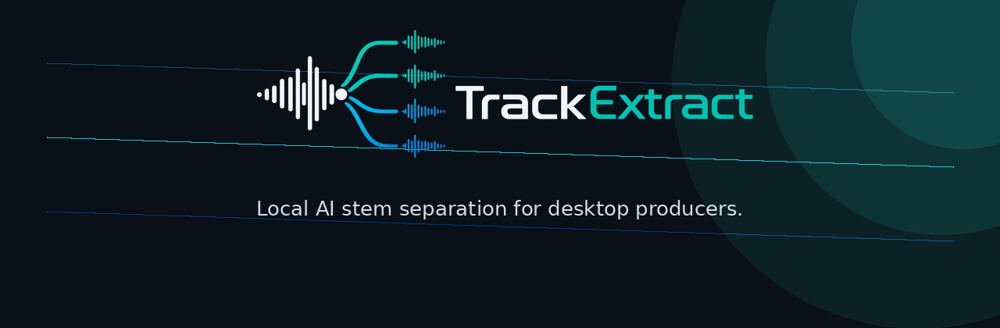
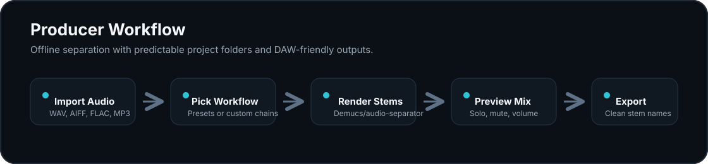
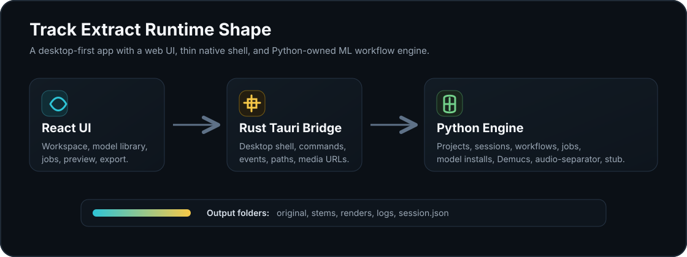

# Track Extract

<p align="center">
  
</p>

<p align="center">
  <strong>Local-first desktop stem separation for producers, engineers, DJs, remixers, and creators.</strong>
</p>

<p align="center">
  <a href="https://github.com/AdamWentworth/TrackExtract/actions/workflows/ci.yml"></a>
  <a href="LICENSE"></a>
  
  
  
</p>

Track Extract is a desktop-first app for local AI stem separation. The goal is a cleaner workflow than
dependency-heavy command-line wrappers: import audio, choose a curated workflow, run an offline render, preview the
generated stems, and export DAW-ready files with predictable names and folders.

The current prototype uses a Tauri + React desktop shell with a Python-owned ML engine. Rust stays intentionally thin:
it handles desktop plumbing, command/event forwarding, local media serving, path resolution, and process cancellation.
Python owns projects, sessions, jobs, model registry state, installs, catalog sync, and separation providers.

<p align="center">
  
</p>

## Current Status

Track Extract is usable as a development prototype, not a polished end-user release.

What works today:

- Desktop app shell with React, TypeScript, Tauri 2, and a thin Rust bridge.
- Browser-based development view on the same local engine state as the desktop window.
- Drag/drop and file-picker audio import.
- Project/session folder creation under `TrackExtract Projects`.
- Job queue with queued, preparing, running, complete, failed, and cancelled states.
- Python providers for Demucs, audio-separator, and stub/test renders.
- Model registry with Demucs presets, downloadable public UVR entries, MVSEP references, source links, and license notes.
- audio-separator catalog sync for discovering local model filenames.
- Stem preview and export flows through stable Tauri commands.
- Multi-step workflow plumbing for curated vocal cleanup chains.

Not included yet:

- No DAW plugin.
- No real-time separation.
- No cloud processing, account system, payments, or subscription logic.
- No fully packaged Python runtime for non-developer installs yet.

## Architecture

<p align="center">
  
</p>

The canonical engine source lives in `engine/src`, packaged as `trackextract_engine`. It exposes
`python -m trackextract_engine` for the Rust bridge and future CLI/service work.

| Layer        | Role                                                                                  |
| ------------ | ------------------------------------------------------------------------------------- |
| `src/`       | React + TypeScript UI for workspace, models, workflows, jobs, preview, and export.    |
| `src-tauri/` | Tauri desktop shell, Rust command bridge, event forwarding, cancellation, media URLs. |
| `engine/`    | Python ML/workflow engine for projects, sessions, jobs, providers, installs.          |
| `resources/` | Bundled model and workflow registries copied into app data.                           |
| `schemas/`   | JSON schemas for model, workflow, and session formats.                                |
| `scripts/`   | Setup, validation, formatting, linting, testing, and registry-generation helpers.     |
| `docs/`      | Architecture, development, packaging, and model-registry notes.                       |

See [docs/architecture.md](docs/architecture.md) for command/event flow and backend boundaries.

## Quick Start

Install JavaScript dependencies:

```bash
npm install
```

Create the managed Python engine environment:

```bash
scripts/setup-trackextract-engine.sh
```

Run the desktop app:

```bash
npm run tauri:dev
```

Track Extract auto-detects `.venv-trackextract-engine/bin/python` when launched from this repo. To force a specific
Python environment, set `TRACKEXTRACT_ENGINE_PYTHON`.

For NVIDIA CUDA support through audio-separator, build the engine environment with the GPU extra:

```bash
TRACKEXTRACT_AUDIO_SEPARATOR_EXTRA=gpu scripts/setup-trackextract-engine.sh
```

For Windows DirectML:

```bash
TRACKEXTRACT_AUDIO_SEPARATOR_EXTRA=dml scripts/setup-trackextract-engine.sh
```

## Linux Tauri Prerequisites

On Ubuntu-like Linux systems, Tauri needs WebKit/RSVG/AppIndicator development packages:

```bash
sudo apt update
sudo apt install pkg-config libdbus-1-dev libwebkit2gtk-4.1-dev build-essential curl wget file libxdo-dev libssl-dev libayatana-appindicator3-dev librsvg2-dev
```

The npm Tauri scripts sanitize Snap VS Code's GTK/GIO environment automatically. Raw `tauri dev` commands launched from
Snap VS Code terminals may still hit a `libpthread` symbol lookup error.

## Browser Development

For browser UI iteration:

```bash
npm run dev:browser
```

When the Vite server is running on `http://localhost:1420`, both the Tauri desktop window and a normal browser tab use
the same local Python engine bridge. Imports, current project/session state, jobs, generated stems, model installs, and
workflow changes are shared during development.

## Models And Workflows

The generated bundled registry lives at `resources/models.json`. Source fragments live under `resources/models/`.

```bash
npm run models:build
npm run test:models
```

Model entries can represent:

- Installed local providers, such as Demucs runtime presets.
- Direct-download public model files.
- audio-separator installable filenames.
- Source references for models that need licensing/artifact follow-up before Track Extract can install them directly.

Workflow presets live in `resources/workflows.json`. The UI also supports custom named workflows.

See [docs/model-registry.md](docs/model-registry.md) for registry structure, source notes, and install-state semantics.

## Checks

Run the full local suite:

```bash
npm run check
```

This runs formatting checks, frontend linting, Python linting, Rust clippy, model/workflow validation, Python engine
tests, frontend tests, production frontend build, and Rust tests.

Network checks for model download URLs are opt-in so local tests are not flaky:

```bash
TRACKEXTRACT_TEST_NETWORK=1 npm run test:all
```

The Linux CI lane also runs the frontend with coverage thresholds and exercises the production build through a
Playwright browser smoke test. Production JavaScript and CSS gzip sizes are checked against explicit budgets.

## Roadmap

1. Package the Python engine cleanly for end users.
2. Expand audio-separator catalog sync into curated installable workflows.
3. Improve multi-step vocal cleanup execution.
4. Add native ONNX Runtime only where it clearly improves packaging or acceleration.
5. Improve batch processing, cancellation, and resumable jobs.
6. Add DAW export templates for Ableton, Logic, Pro Tools, Reaper, and FL Studio.
7. Explore a future VST3/AU bridge plugin that talks to the same offline Track Extract engine.

## License

Track Extract is released under the [MIT License](LICENSE).
